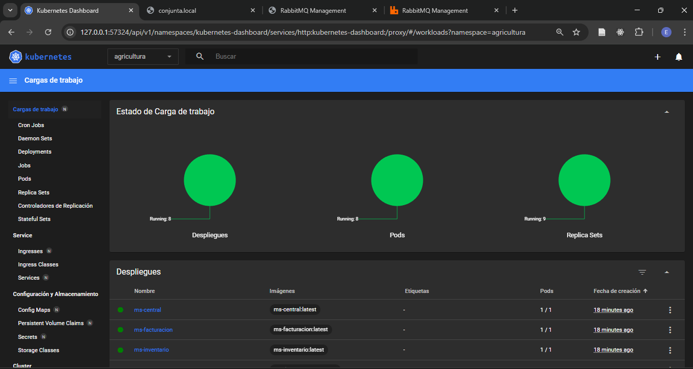
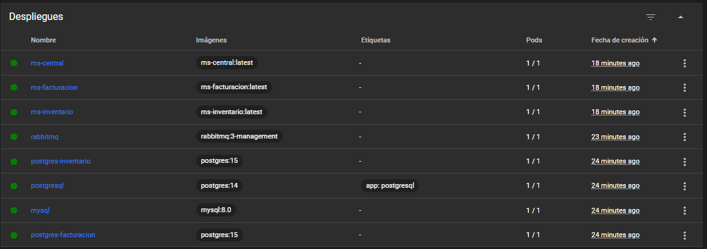
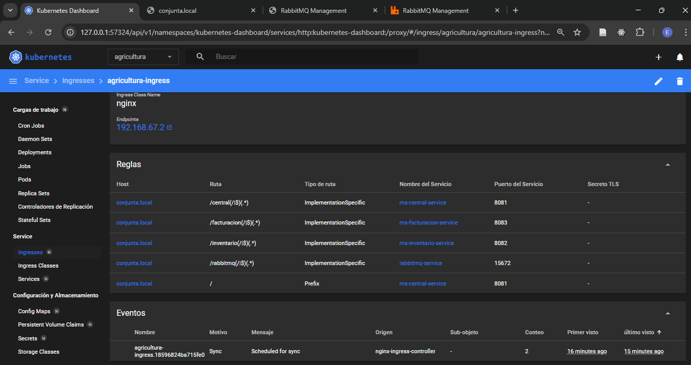
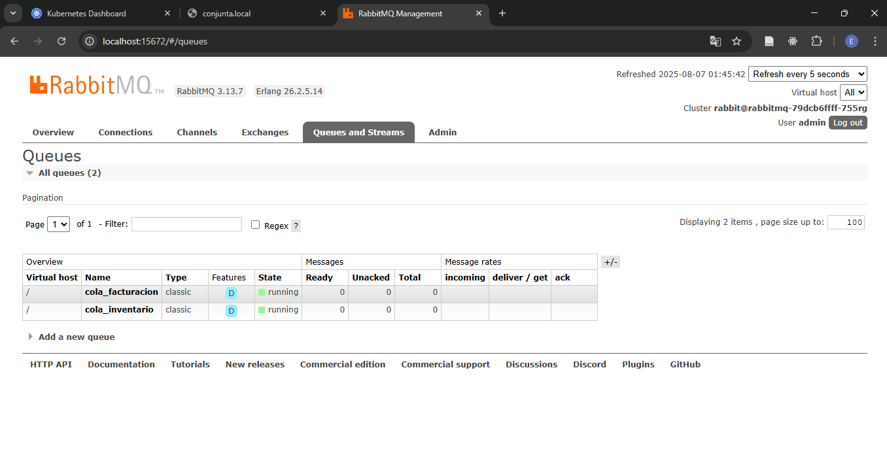
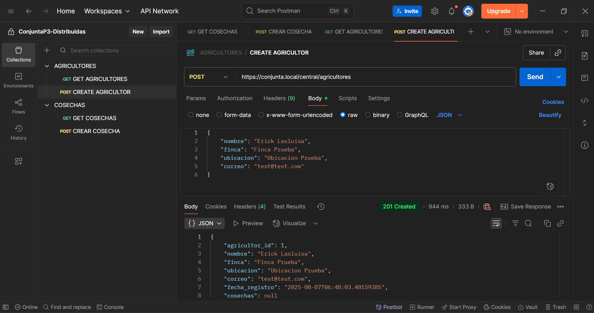
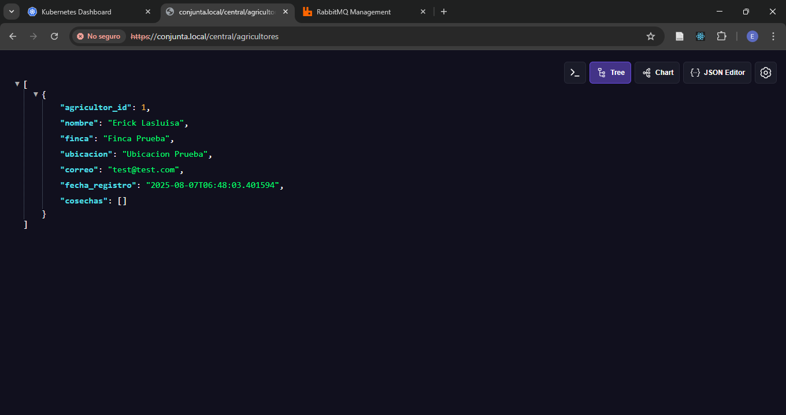
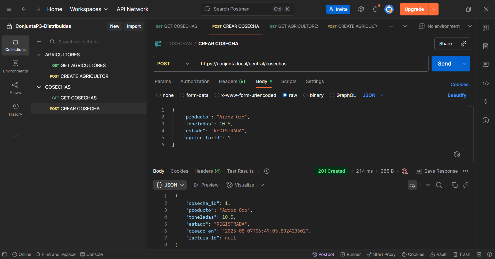

### Prueba Conjunta Parcial 3 - Aplicaciones Distrubuidas

---

### Integrantes:
- Añasco Silvia
- Enriquez Sheylee
- Lasluisa Erick

---

### Capturas de pantalla de la ejecución del código:

Dashboard Kubernetes
 

Despliegues en Kubernetes exitosos

Ingress definidos para acceder a través de la url “https://conjunta.local” 
 

Colas de RabbitMQ desde “http://conjunta.local/rabbitmq”

Crear agricultor con POSTMAN 

Visualizar agricultores desde el navegador con la url de “http://conjunta.local/central/agricultores”
 

Creacion de cosechas con POSTMAN 
 